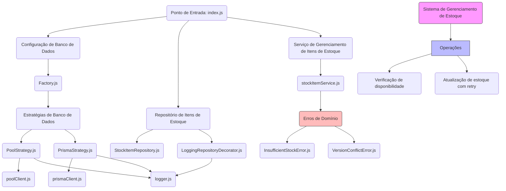
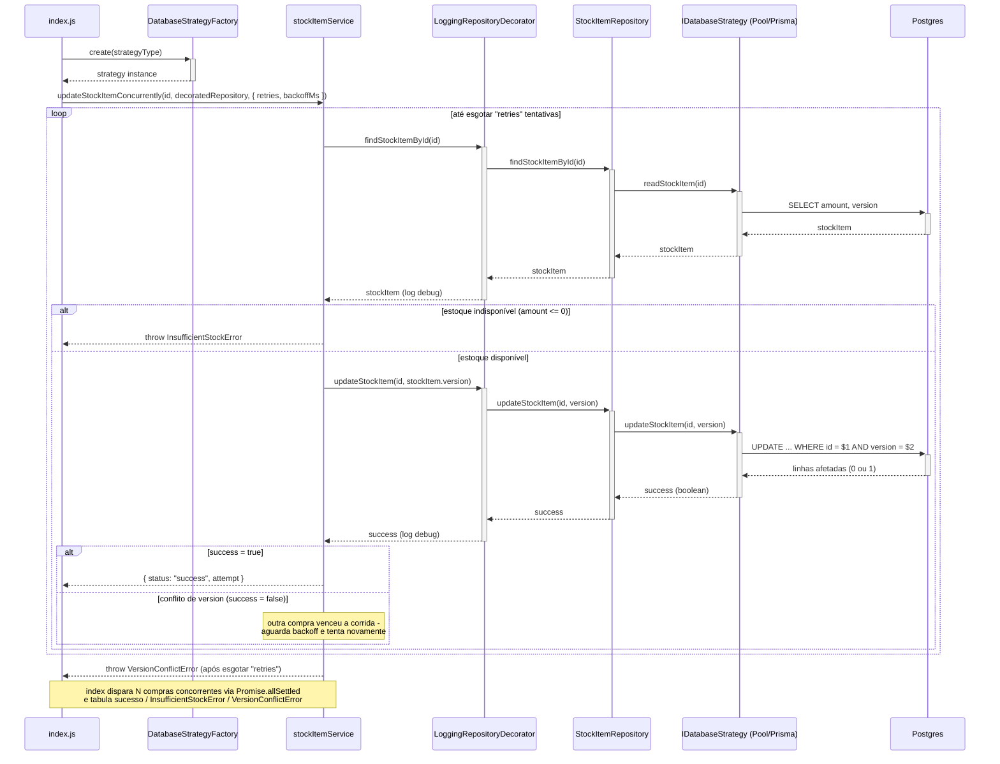
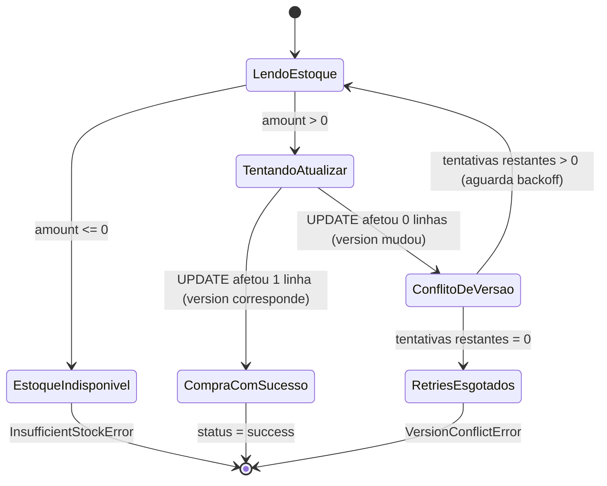

# Controle de Concorrência Otimista em Estoque

Demonstração prática de **Controle de Concorrência Otimista (CCO)** aplicado a uma atualização de estoque concorrente, em Node.js + PostgreSQL, com duas implementações intercambiáveis de acesso a dados (`pg` puro e Prisma).

## Sumário

- [O Problema](#o-problema)
- [A Solução: CCO](#a-solução-cco)
- [CCO vs Bloqueio Pessimista](#cco-vs-bloqueio-pessimista)
- [Arquitetura](#arquitetura)
- [Setup Local](#setup-local)
- [Executando a Demonstração](#executando-a-demonstração)
- [Testes](#testes)
- [Trocando de Strategy (pool vs prisma)](#trocando-de-strategy-pool-vs-prisma)
- [Padrões de Design](#padrões-de-design)

## O Problema

Em sistemas com alta concorrência, múltiplas requisições podem tentar decrementar o mesmo registro de estoque ao mesmo tempo. Sem controle de concorrência, isso gera **race conditions**: duas leituras simultâneas do mesmo valor podem resultar em duas escritas que se sobrepõem, fazendo o estoque ficar inconsistente (ou, no piso caso, negativo).

## A Solução: CCO

O Controle de Concorrência Otimista assume que conflitos são raros e não usa locks — ele permite que as transações leiam e tentem escrever livremente, e só verifica conflito **no momento da escrita**, comparando uma coluna de versão:

```sql
UPDATE stocks
SET amount = amount - 1, version = version + 1
WHERE id = $1 AND version = $2
RETURNING *;
```

Se, entre a leitura e a escrita, outra transação já tiver alterado o registro (e portanto incrementado `version`), essa instrução não encontra nenhuma linha para atualizar — a query retorna 0 linhas afetadas, e a aplicação sabe que houve um conflito. Essa verificação ocorre numa única instrução SQL atômica, então o próprio banco resolve a corrida — não é necessário lock explícito nem transação aberta.

Quando isso acontece, o serviço (`src/services/stockItemService.js`) faz **retry com backoff**: relê o item, obtém a `version` atual e tenta de novo, até esgotar um número configurável de tentativas — só então desiste e reporta o conflito.

## CCO vs Bloqueio Pessimista


|                                  | Otimista (este projeto)                 | Pessimista (`SELECT ... FOR UPDATE`)      |
| -------------------------------- | --------------------------------------- | ----------------------------------------- |
| Quando trava o registro          | Nunca — só verifica no `UPDATE`         | Desde o `SELECT`, até o fim da transação  |
| Throughput sob baixa contenção   | Alto (sem espera)                       | Mais baixo (lock mesmo sem conflito real) |
| Comportamento sob alta contenção | Conflitos frequentes, exige retry       | Fila de espera por lock, sem retries      |
| Complexidade na aplicação        | Maior (precisa tratar conflito e retry) | Menor (banco bloqueia, app só espera)     |
| Indicado para                    | Conflitos raros, operações curtas       | Conflitos frequentes no mesmo registro    |


Não existe "o melhor" entre os dois — é uma escolha de trade-off. Este projeto usa otimista porque o cenário de demonstração (muitas compras concorrentes contra o mesmo item) é exatamente o caso em que vale a pena evitar o custo de um lock quando a maioria das tentativas teria sucesso de qualquer forma.

## Arquitetura

```
index.js
  └─ DatabaseStrategyFactory (Factory)
       └─ PoolStrategy | PrismaStrategy (Strategy, implementam IDatabaseStrategy)
  └─ StockItemRepository (Repository)
       └─ LoggingRepositoryDecorator (Decorator)
  └─ stockItemService (retry + erros de domínio)
```

- **Strategy**: `IDatabaseStrategy` define o contrato (`readStockItem`, `updateStockItem`); `PoolStrategy` (usa `pg` diretamente) e `PrismaStrategy` (usa Prisma) o implementam, intercambiáveis via `DATABASE_STRATEGY`.
- **Factory**: `DatabaseStrategyFactory` centraliza a criação da strategy escolhida.
- **Repository**: `StockItemRepository` abstrai a strategy ativa da camada de serviço.
- **Decorator**: `LoggingRepositoryDecorator` adiciona logs de cada leitura/escrita sem alterar o repositório original.
- **Service**: `stockItemService` orquestra a leitura, a tentativa de escrita otimista, o retry em caso de conflito e os erros de domínio (`InsufficientStockError`, `VersionConflictError`).

### Diagrama de camadas



### Sequência da compra



### Fluxo de estados da compra



Mais detalhes sobre os padrões de design usados: `[DesignPatternsGuide_DataAccessProject.md](DesignPatternsGuide_DataAccessProject.md)`.

## Setup Local

Pré-requisitos: Node.js 24 LTS (ver [`.nvmrc`](.nvmrc) — `nvm use`), Docker (para o Postgres).

> O projeto é 100% ESM (`"type": "module"`) e usa quase só recursos nativos do Node: o test runner é o `node:test`, as variáveis de ambiente são carregadas via flag nativa `--env-file-if-exists` (sem o pacote `dotenv`), e o Node 24 faz *type-stripping* nativo de TypeScript — usado para importar o client do Prisma 7 (`src/generated/prisma/client.ts`) sem `ts-node`/`tsx`. As únicas dependências de runtime são `pg`, `@prisma/client` e `@prisma/adapter-pg` — não há driver Postgres nativo no Node, e o Prisma é uma das duas strategies comparadas pelo projeto. Desde o Prisma 7, o `PrismaClient` exige um *driver adapter*; por isso a `PrismaStrategy` também passa a rodar sobre `pg` por baixo dos panos — mantemos, ainda assim, pools de conexão independentes entre as duas strategies, para preservar a comparação ORM vs. driver cru.

```bash
npm install
cp .env.example .env          # ajuste DATABASE_URL se necessário
docker compose up -d          # sobe o Postgres em localhost:5432
npm run seed:prisma           # cria o item de estoque inicial (amount: 10)
```

> `npm start`, `npm run dev`, `npm test` e `npm run seed:prisma` aplicam as migrations pendentes automaticamente antes de rodar (via os hooks `prestart`/`predev`/`pretest`/`preseed:prisma` do npm — `npx prisma migrate deploy` é idempotente, não recria nada se já estiver tudo aplicado). Por isso o erro "a tabela `stocks` não existe" não deveria mais acontecer, mesmo recriando o container do Postgres do zero.

Variáveis de ambiente disponíveis (ver `[.env.example](.env.example)`):


| Variável                                   | Padrão             | Descrição                                                     |
| ------------------------------------------ | ------------------ | ------------------------------------------------------------- |
| `DATABASE_URL`                             | —                  | String de conexão do Postgres                                 |
| `DATABASE_STRATEGY`                        | `pool`             | `pool` (pg) ou `prisma`                                       |
| `LOG_LEVEL`                                | `info`             | Nível do logger (`debug` mostra cada chamada do decorator)    |
| `STOCK_ITEM_ID`                            | id fixo de exemplo | Item de estoque usado pela demo e pelo seed                   |
| `SEED_STOCK_AMOUNT` / `SEED_STOCK_VERSION` | `10` / `0`         | Estoque inicial criado pelo seed — útil para simular cenários |


## Executando a Demonstração

```bash
npm start
```

O script dispara 100 tentativas de compra concorrentes contra o mesmo item e imprime um resumo classificando cada tentativa:

```json
{"summary":{"success":10,"InsufficientStockError":85,"VersionConflictError":5},"msg":"Resumo das tentativas"}
{"finalStockItem":{"id":"...","amount":0,"version":10},"msg":"Resultado final do estoque"}
```

- `success`: a compra decrementou o estoque com sucesso.
- `VersionConflictError`: perdeu a corrida em todas as tentativas de retry permitidas (esgotou `retries`).
- `InsufficientStockError`: ao tentar comprar, o estoque já estava zerado.

Para simular outros cenários sem editar código, ajuste o seed antes de rodar:

```bash
SEED_STOCK_AMOUNT=0 npm run seed:prisma && npm start   # forca 100% InsufficientStockError
SEED_STOCK_AMOUNT=1 npm run seed:prisma && npm start   # forca disputa intensa por 1 unidade
```

## Testes

```bash
npm run test:unit          # mocks, sem banco
npm run test:integration   # requer Postgres com migrations aplicadas (inclui o teste de concorrencia)
npm test                   # os dois
```

O teste de concorrência (`test/integration/concurrency.test.js`) dispara 100, 500 e 1000 compras simultâneas contra um estoque de 10 unidades e garante:

- o estoque nunca fica negativo;
- o número de compras bem-sucedidas é exatamente igual ao estoque inicial.

`test/integration/stockPurchaseFlow.gwt.test.js` cobre o fluxo de compra (`stockItemService`) no estilo **Dado/Quando/Então** (Given/When/Then), incluindo dois cenários de conflito de versão simulados deterministicamente (sem depender de timing real): um conflito único que se recupera no retry, e conflitos persistentes que esgotam as tentativas e lançam `VersionConflictError`.

## Trocando de Strategy (pool vs prisma)

```bash
DATABASE_STRATEGY=prisma npm start
DATABASE_STRATEGY=pool npm start
```

Ambas implementam o mesmo contrato (`IDatabaseStrategy`) e são cobertas pelos mesmos testes de integração.

## Padrões de Design

Strategy, Factory, Decorator e Repository — motivação e exemplos de código em `[DesignPatternsGuide_DataAccessProject.md](DesignPatternsGuide_DataAccessProject.md)`.
