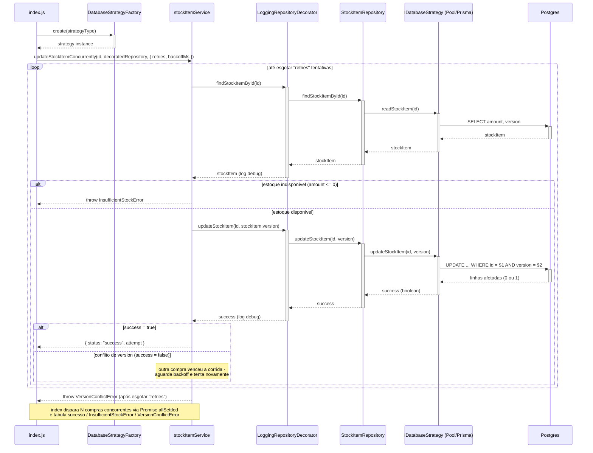

```mermaid
sequenceDiagram
    participant index as index.js
    participant factory as DatabaseStrategyFactory
    participant service as stockItemService
    participant decorator as LoggingRepositoryDecorator
    participant repository as StockItemRepository
    participant strategy as IDatabaseStrategy (Pool/Prisma)
    participant db as Postgres

    index->>+factory: create(strategyType)
    factory-->>-index: strategy instance
    index->>service: updateStockItemConcurrently(id, decoratedRepository, { retries, backoffMs })

    loop até esgotar "retries" tentativas
        service->>+decorator: findStockItemById(id)
        decorator->>+repository: findStockItemById(id)
        repository->>+strategy: readStockItem(id)
        strategy->>+db: SELECT amount, version
        db-->>-strategy: stockItem
        strategy-->>-repository: stockItem
        repository-->>-decorator: stockItem
        decorator-->>-service: stockItem (log debug)

        alt estoque indisponível (amount <= 0)
            service-->>index: throw InsufficientStockError
        else estoque disponível
            service->>+decorator: updateStockItem(id, stockItem.version)
            decorator->>+repository: updateStockItem(id, version)
            repository->>+strategy: updateStockItem(id, version)
            strategy->>+db: UPDATE ... WHERE id = $1 AND version = $2
            db-->>-strategy: linhas afetadas (0 ou 1)
            strategy-->>-repository: success (boolean)
            repository-->>-decorator: success
            decorator-->>-service: success (log debug)

            alt success = true
                service-->>index: { status: "success", attempt }
            else conflito de version (success = false)
                Note over service: outra compra venceu a corrida -<br/>aguarda backoff e tenta novamente
            end
        end
    end

    service-->>index: throw VersionConflictError (após esgotar "retries")

    Note over index,service: index dispara N compras concorrentes via Promise.allSettled<br/>e tabula sucesso / InsufficientStockError / VersionConflictError
```
