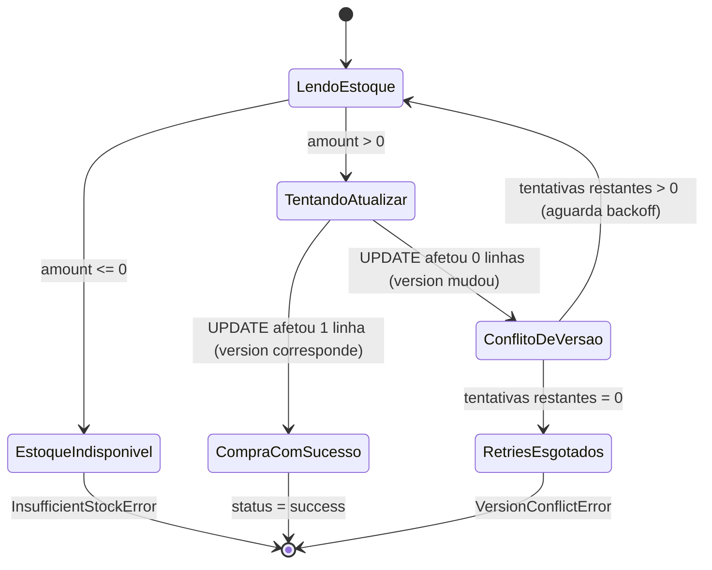

```mermaid
stateDiagram-v2
    [*] --> LendoEstoque

    LendoEstoque --> EstoqueIndisponivel: amount <= 0
    LendoEstoque --> TentandoAtualizar: amount > 0

    TentandoAtualizar --> CompraComSucesso: UPDATE afetou 1 linha (version corresponde)
    TentandoAtualizar --> ConflitoDeVersao: UPDATE afetou 0 linhas (version mudou)

    ConflitoDeVersao --> LendoEstoque: tentativas restantes > 0 (aguarda backoff)
    ConflitoDeVersao --> RetriesEsgotados: tentativas restantes = 0

    EstoqueIndisponivel --> [*]: InsufficientStockError
    CompraComSucesso --> [*]: status = success
    RetriesEsgotados --> [*]: VersionConflictError
```
